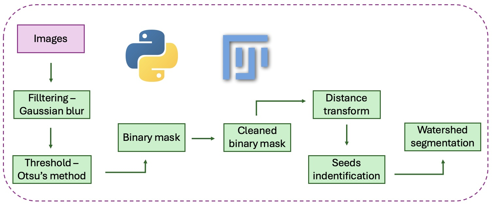

# Classical Nuclei Segmentation in Python

This repository contains the Python implementation of a classical nuclei segmentation workflow developed as part of the project:

**"From 2D to 3D: Nuclei Segmentation Using ImageJ and Python."**

The complete project report can be found in the **[Report](Report/F2_REPORT_Nuclei_segmentation_DiepThai.pdf)** section of this repository.

The workflow performs nuclei segmentation using classical image processing techniques, including:

- Gaussian filtering
- Otsu thresholding
- Morphological operations
- Distance transform
- Watershed segmentation
- Segmentation visualization

  

  Figure 1. Flowchart of nuclei segmentation pipeline implemented in both Python and Fiji.

The pipeline is implemented in **Python** using **scikit-image**, **SciPy**, and **Matplotlib**.
